# 图
- 定义：图(Graph)是由顶点的有穷非空集合和顶点之间边的集合组成; 通常表示为:G(V,E),G表示一个图，V是图G中顶点的集合，E是图G中边的集合。
- 图的阶：|V|，图顶点的个数
- 图边的条数：|E|
- 图的顶点集不可以为空，边集可以为空
- 分类：
  - 无向图：E的元素为无向边(也称边)，是顶点的无序对
    - e.g. E={(A,B),(B,C)}
  - 有向图：E的元素为有向边(也称弧)，是顶点的有序对，第一个顶点是弧头，第二个是弧尾
    - e.g. E={<A,B>,<B,C>}
  - 简单图：
    1. E不包含指向从一个顶点开始，指向这个顶点自身的边
    2. E不包含重复的边
  - 多重图：E可以包含指向顶点自身的边和重复的边
- 无向图顶点的度：对于无向图，顶点v的度是依附于该顶点的边的条数，记作TD(v)
  - 无向图所有顶点度之和为2|E|
- 有向图顶点的入度/出度/度：对于有向图，顶点v的入度是以该顶点为终点的边的条数，记作ID(v)；出度是以该顶点为起点的边的条数，记作OD(v)；度是该顶点的入度和出度之和，记作TD(v)
  - 有向图所有顶点度之和为2|E|，入度之和=初度之和=|E|
- 路径：从一个顶点到另一个顶点经过的顶点序列
- 回路：起点和终点相同的路径
- 简单路径：顶点序列中无重复顶点
- 简单回路：除起点和终点，顶点序列中无重复顶点
- 路径长度：路径上边的数目
- 点到点的距离：两个顶点之间最短路径长度，若不存在路径，记为∞
- 无向图的连通：如果从顶点v到顶点w有路径，则v和w是连通的
  - 连通图：如果无向图每两个顶点都是连通的，则称该图为连通图
    - 设顶点数为n，连通图最少有n-1条边(选一个顶点和其他n-1个顶点相连)，非连通图最多有C2n-1条边(选取一个顶点，让其他顶点全部两两相连，这个顶点什么都不连)
- 有向图的强连通：如果从顶点v到顶点w以及从w到v都有路径，则v和w是强连通的
  - 强连通图：如果有向图每两个顶点之间都是强连通的，则称该图为强连通图
    - 设顶点数为n，强连通图最少有n条边(所有顶点连成一条回路)
- 子图：如果已存在顶点集为V，边集为E的图G，那么顶点集为V'⊆V，边集为E'⊆E的图G'称为G的子图(子图每条边的两个顶点必须在顶点集中)
  - 生成子图：V(G)=V(G')，G和G'的顶点集相同，那么G'是G的生成子图(就是原图不去或去掉几条边)
- 连通分量：无向图中的极大连通子图(包含尽可能多的顶点和尽可能多的边)
- 强连通分量：有向图中的极大强连通子图(包含尽可能多的顶点和尽可能多的边)
- 生成树：无向图中的包含全部顶点的极小连通子图(包含尽可能少的边(n-1条边)，但要保持连通，可能有多个)
- 生成森林：在无向非连通图中，连通分量的生成树构成生成森林
- 边的权：给边赋予的带有具体含义的数值
- 带权图(网)：边上有权的图叫带权图，也叫网
- 带权路径长度：带权图中某一路径上所有边的权的和
- 无向完全图：无向图的每两个顶点都有一条边，共有C2n条边
- 有向完全图：有向图的每两个顶点之间都有两条指向彼此的弧，共有2\*C2n条边
- 稀疏图：|E|<|V|log10|V|的图
  - 反之为稠密图
- 树：不存在回路，且连通的无向图，有n-1条边
- 有向树：一个顶点入度为0，其他所有顶点入度为1的树
- 常考考点：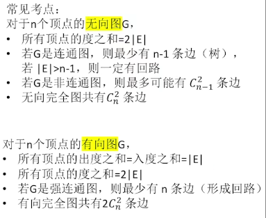

- 存储结构：
  - 邻接矩阵法：
    - 图解：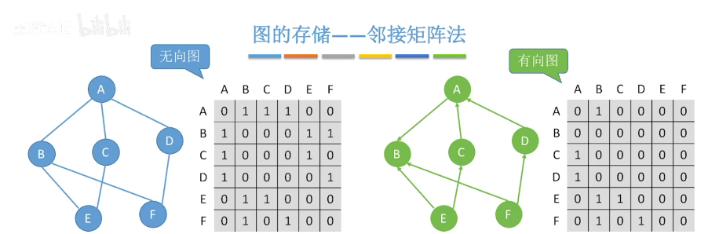
    - 求无向图的度：顶点所对应的行/列非零元素个数
    - 求有向图的出度：顶点对应的行非零元素个数
    - 求有向图的入度：顶点对应的列非零元素个数
    - 这三种方法时间复杂度均为O(|V|)
    - 存储带权图(网)：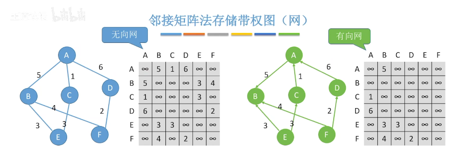
      - 或：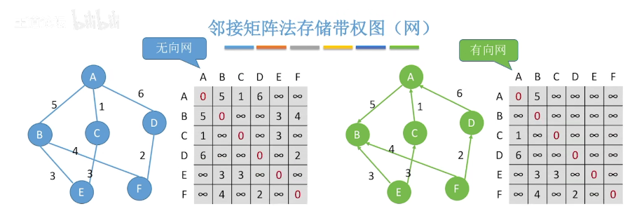
    - 空间复杂度：O(|V|2)，只和顶点数有关，和边数无关，适合存储稠密图
    - 无向图的矩阵是对称矩阵，可以压缩存储
    - 设图G的邻接矩阵为A，则An[i][j] (i,j为矩阵下标)为从第i个结点开始到第j个结点结束且长度为n的路径条数
      - 图解：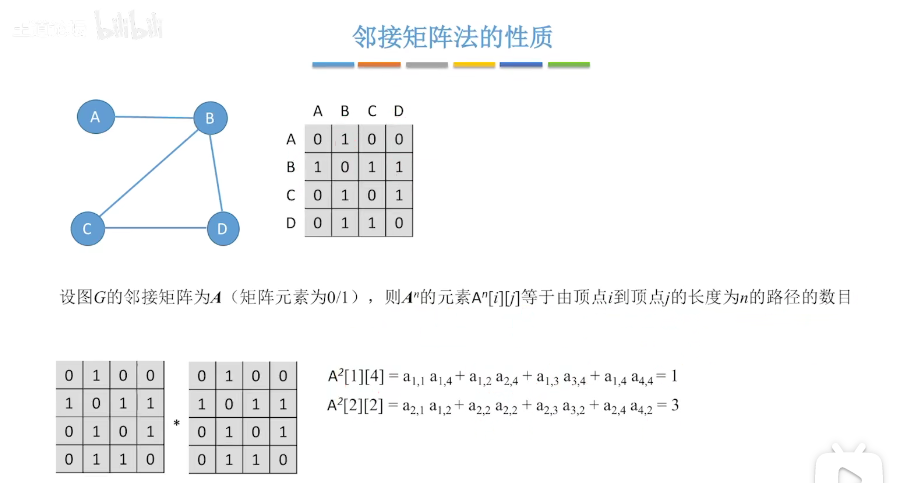
        - 解释：e.g. 对于a1,2a2,4，a1,2表示从A到B的长度为1的路径条数，a2,4表示从B到D的长度为1的路径条数，两个相乘就是从A到D的长度为2的路径条数
  - 邻接表法：
    - 由顶点数组构成，每个顶点包含数据域和指向依附于该顶点的第一个边结点的指针，每个边结点又包括边终点的数组下标和指向依附于该边起点的下一条边
    - 对于有向图，求某个顶点入度或者度时需要遍历每个边才能找到所有指向该顶点的边，时间复杂度为O(|E|)
  - 十字链表法：
    - 图解：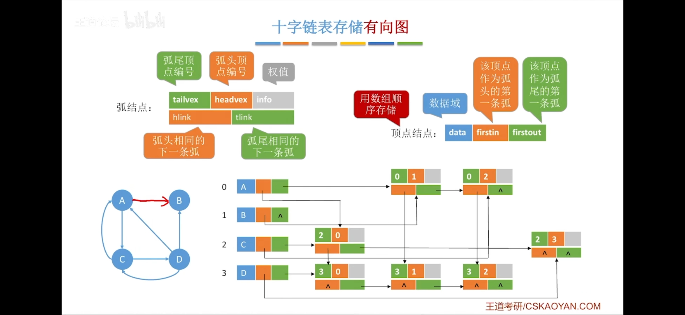
  - 邻接多重表法：
    - 图解：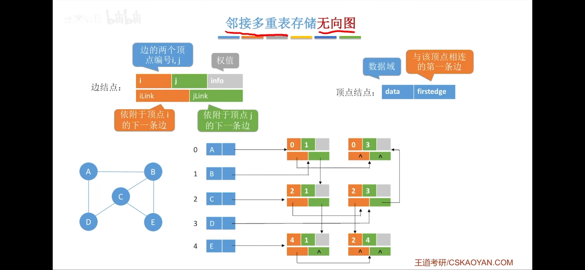
  - 总结：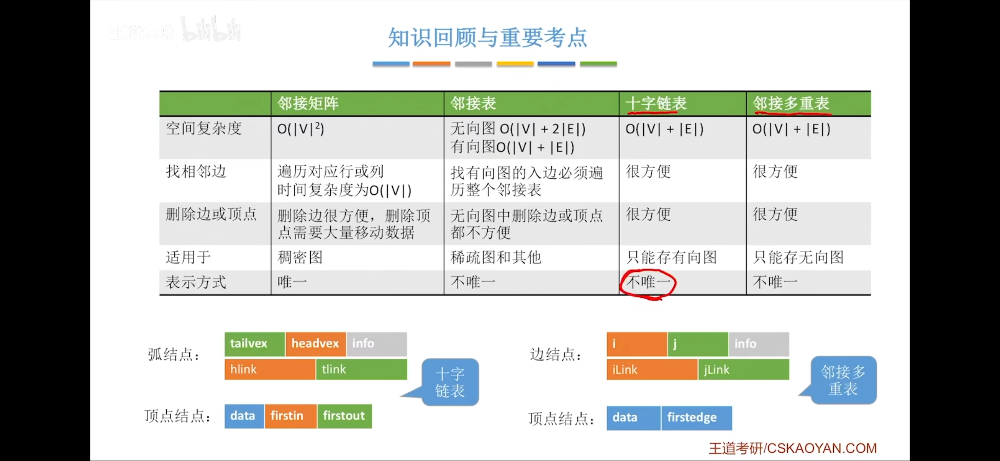
- 图的操作：
  - 图解：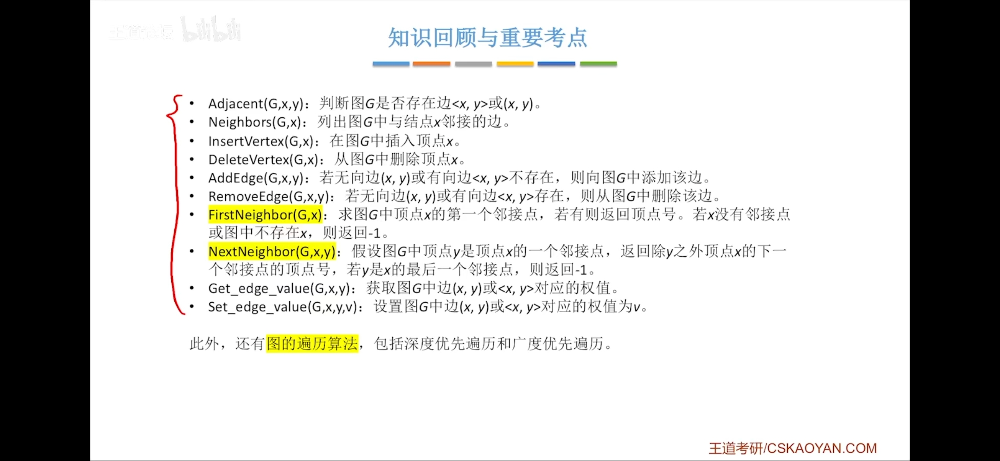
- 图的广度优先遍历(BFS):
  - 算法：
  1. 对于连通图，从一个结点开始，
  2. 对于非连通图，需要在进行一次上述连通图的操作后继续检查所有顶点是否被访问并对未被访问的结点进行上述对连通图的操作，直到所有顶点都被访问
  - 空间复杂度：O(|V|)，因为要构建长度最多为|V|的辅助队列
  - 时间复杂度：
    1. 对于邻接矩阵，需要遍历每个顶点和检查每个顶点的邻接点，需要O(|V|2)
    2. 对于邻接表，需要遍历每个顶点和每条边，需要O(|V|+|E|)
  - 广度优先生成树：由广度优先序列生成的树
    - 邻接矩阵的广度优先生成树唯一，因为序列唯一
    - 邻接表的广度优先生成树不唯一，因为序列不唯一
  - 广度优先生成森林：由非连通图的所有连通分量的广度优先序列生成的森林
- 图的深度优先遍历(DFS)：
  - 算法：
  1. 对于连通图，定义一个DFS函数：从一个顶点开始，访问该顶点，然后对它的所有邻接点调用DFS函数
  2. 对于非连通图，需要在进行一次上述连通图的操作后继续检查所有顶点是否被访问并对未被访问的结点进行上述对连通图的操作，直到所有顶点都被访问
  - 空间复杂度：O(|V|)，因为最坏情况是图是一个线性表，即如果有n个顶点就要递归调用n次DFS
  - 时间复杂度：
    1. 对于邻接矩阵，需要遍历每个顶点和检查每个顶点的邻接点，需要O(|V|2)
    2. 对于邻接表，需要遍历每个顶点和每条边，需要O(|V|+|E|)
  - 深度优先生成树：由深度优先序列生成的树
    - 邻接矩阵的深度优先生成树唯一，因为序列唯一
    - 邻接表的深度优先生成树不唯一，因为序列不唯一
  - 深度优先生成森林：由非连通图的所有连通分量的深度优先序列生成的森林
- 最小生成树：连通图的所有生成树中边权值和最小的
  - 构建：
    1. Prim算法：选取一个顶点，将它周围权值最小的边连通，然后再将这两个顶点生成的树周围权值最小的边连通，以此类推直到形成生成树
        - 时间复杂度O(|V|2)，适合稠密图
    2. Krustal算法：每次将权值最小的边连通，如果连过则不连，直到形成生成树
        - 时间复杂度O(|E|log2|E|)，适合稀疏图
- 最短路径问题：
  - 从某一顶点开始到其他所有顶点：
    1. BFS算法(适用于无权图)：
       - 过程：
         - 和BFS类似，选取一个顶点作为起点，另外用一个dist数组保存最短距离，path数组保存直接前驱，isVisited保存是否访问
         - 开始时，如果起点是i，让dist数组的每个元素都是0，path[i]=-1，isVisited的每个元素都为false
         - 将i加入辅助队列
         - 重复：
           - 辅助队列队头出队，假设是u，让isVisited[u]=true，遍历u的所有未被访问的邻接点并加入队尾，假设j被加入了队尾，那么让path[j]=u，dist[j]=dist[u]+1
         - 直到队列为空
       - 时间复杂度：同BFS
    2. Dijkstra算法(适用于有权图/无权图)：
       - 过程：
         - 选取一个顶点作为起点，记为i，定义一个数组isShortest保存顶点是否已是最短路径，dist数组记录顶点到i的距离，path记录顶点在最短路径的直接前驱
         - 开始时，假设图对应的权二维数组为arcs，遍历所有顶点，记被遍历的顶点为j，如果arcs[i][j]!=INFINITY，让dist[j]=arcs[i][j]，path[j]=i，否则如果i到j没有路径，让dist[j]=INFINITY，path=-1；对于i自身，让dist[i]=0，path[i]=-1
         - 重复：
           - 遍历所有顶点，将满足isShortest数组值为false且dist值最小的顶点挑出来记为m，让isShortest[m]=true，然后遍历m的所有邻接点k，如果isShortest[k]==false而且dist[m]+arcs[m][k]<dist[k]，那么让dist[k]=dist[m]+arcs[m][k]，path[k]=m
         - 直到isShortest数组的所有值均为true
       - 时间复杂度：O(|V|2)
       - 缺点：不能处理权值中含有负数的图
  - 任意两两顶点之间：
    - Floyd算法：
      - 过程：
        - 将邻接矩阵复制一份，叫A，用于记录两个顶点间的最小距离，再创建一个开始时所有值都为-1的path数组，用于记录两个顶点之间达到最小距离需要的中转点(值为-1代表不需要中转点即达到最小路径)
        - 遍历所有顶点记为i，被遍历的顶点表示可以以这个顶点为中转点，每次遍历时，再遍历每条边，记为A[j][k]，如果A[j][i]+a[i][k]<A[j][k]，那么就让A[j][k]=A[j][i]+a[i][k]，path[j][k]=i
        - 遍历完成后，A矩阵即为最短路径的矩阵，path即为两个顶点的中转点
      - 使用path：假设找j和k之间最小路径，那么检查j和k之间是否有中转点，如果有i，再在j,i,k这个序列中查找j和i，i和k之间是否有中转点，如果有再继续在添加了中转点的序列中查找，直到序列中相邻两个顶点之间都没有中转点
      - 时间复杂度：O(|V|3)
  - 比较：
- 有向无环图描述表达式：
  - 例子：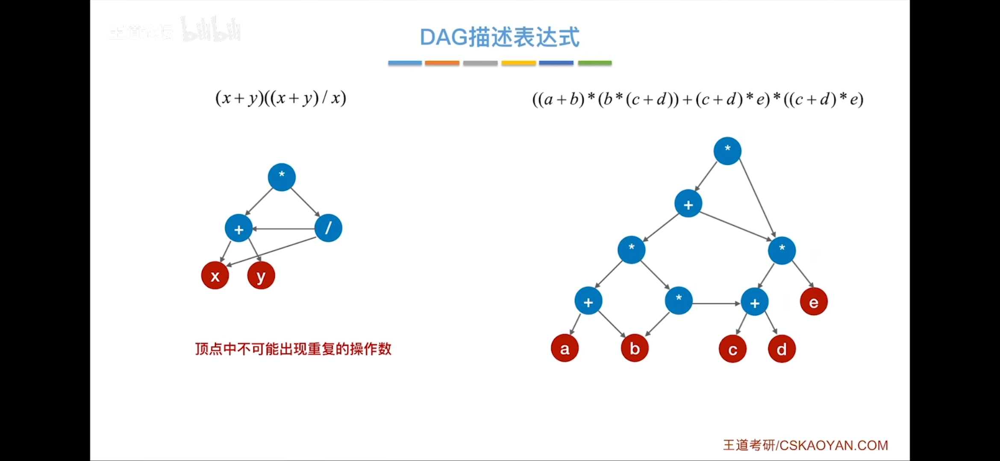
  - 方法：
    1. 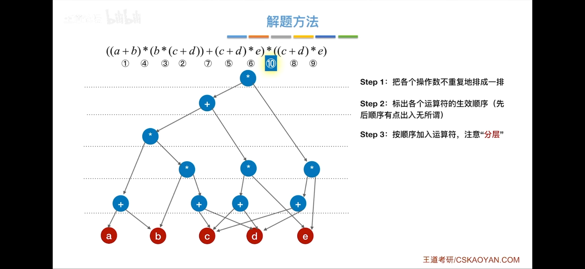
    2. 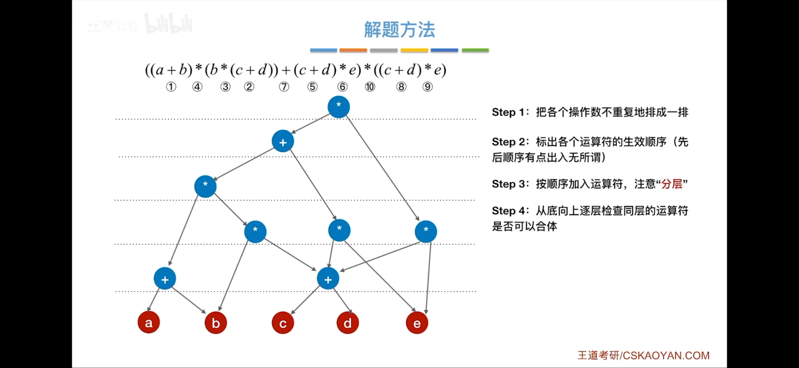
    3. 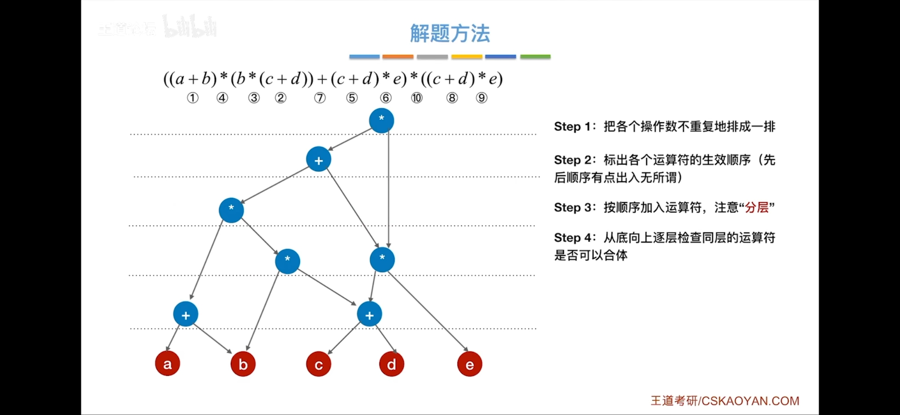
