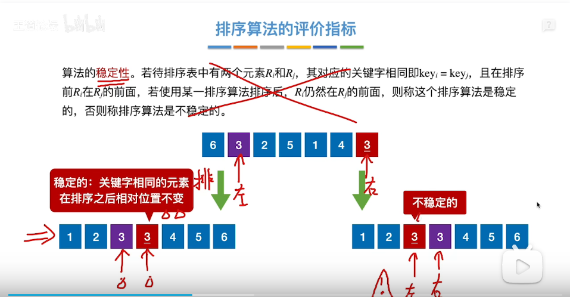
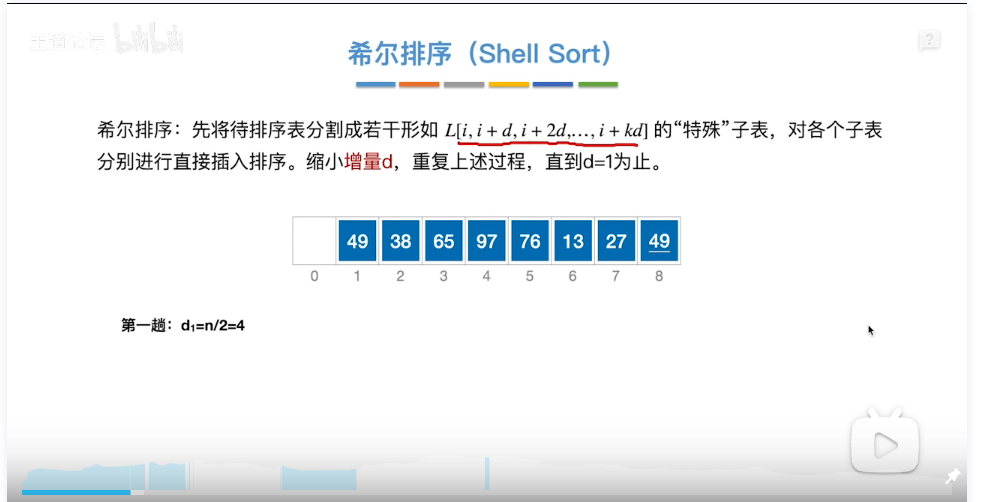
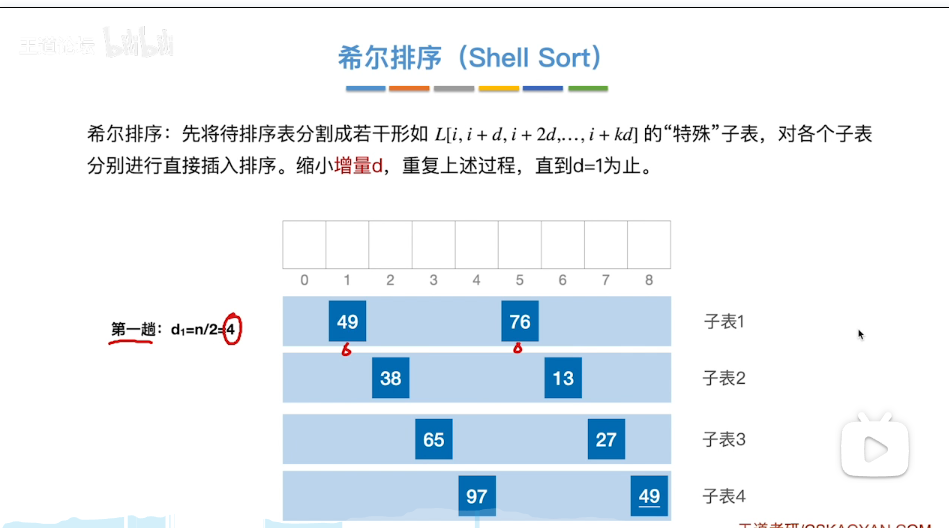
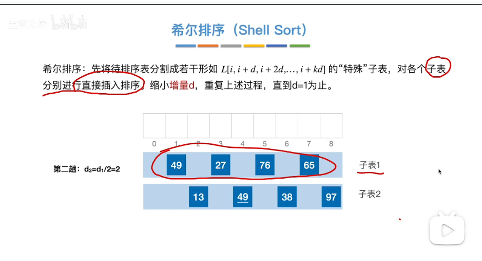
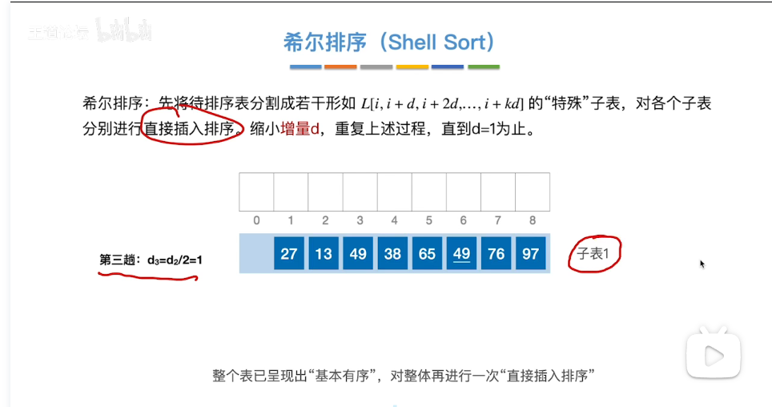
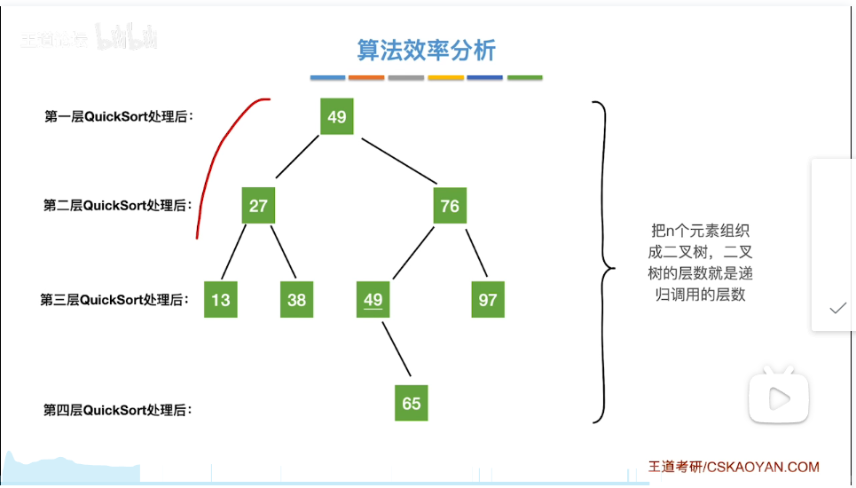

# 排序
- 定义：重新排列表中元素使其按关键字排列
- 评价指标：
  1. 时间复杂度
  2. 空间复杂度
  3. 稳定性(重点)
- 分类
  1. 内部排序：数据都在内存中
      - 关注如何使算法时间、空间复杂度更低 
  2. 外部排序：数据过多，无法全部放入内存
      - 关注如何减少读写磁盘次数
- 插入排序：
  - 直接插入排序
    - 思路：每次将下一个未排序的元素插入到已排序的序列中
    - 实现：第一个元素认为已经排序，从第二个元素开始，每次从未排序的元素从后往前遍历，用temp临时变量储存未排序的元素，每次遍历时让遍历的前一个元素覆盖被遍历的元素(相当于元素后移，给要被放进序列的未排序的元素让位)，直到未排序的元素大于被遍历的前一个元素或者已经遍历到第一个元素，这个时候把temp赋给被遍历的元素
    - 空间复杂度：O(1)
    - 时间复杂度：来源于对比关键字、移动元素
    - 最好情况：要排序的序列已经有序，每次只要对比元素1次，移动元素0次，一共n-1次，时间复杂度O(n)
    - 最坏情况：要排序的序列是逆序，第i趟要对比i+1次，移动i+2次，时间复杂度O(n2)
    - 平均：O(n2)
    - 稳定性：稳定
  - 优化：折半插入排序
    - 思路：查找未排序的元素插入的位置时用折半查找，其余步骤和直接插入相同
    - 实现：每次将已排序列表的第一个元素作为low，最后一个元素作为high，low>high时折半查找停止，把low到被插入元素的前一个位置的所有元素右移一次，把要插入的元素放在原来low的位置
      - 注意：当mid和被插入的元素相同时不停止查找，继续在mid的右边的序列查找(low=mid+1)，为了保证算法稳定性
      - 注意：当low比被插入元素的前一个位置还大时，不移动元素
  - 对链表的插入排序
    - 特点：移动元素的次数变少，但比对关键字仍然时O(n2)
- 希尔排序：
  - 图解：
  - 注意：最后一次的增量必定是1
  - 注意：考试中增量不一定是前一次的一半，可能是任意的
  - 高频题型：给定序列及每次的增量，判断每次排序后的状态
  - 代码实现注意：ShellSort.cpp的直接插入排序步骤是在多个子表中交替进行的
  - 空间复杂度：O(1)
  - 时间复杂度：和增量序列选择有关，O(n1.3)~O(n2)(d一开始=1，直接插排)
  - 稳定性：不稳定
  - 局限性：仅适用于顺序表
- 冒泡排序：
  - 思路：第一趟从第一个元素开始，从前往后比较两两元素的值，如果逆序就交换，第二趟从第二个元素开始，以此类推。如果有任何一趟没有发生交换，就排序完成
  - 稳定性：稳定
  - 空间复杂度：O(1)
  - 时间复杂度：
    - 最好情况(有序)：O(n)
      - 比较次数=n-1，交换次数=0
    - 最坏情况(倒序)：O(n2)
      - 比较次数=n(n-1)/2=交换次数=移动次数/3
    - 平均：O(n2)
  - 适用性：可用于顺序表、链表
- 快速排序：
  - 思路：每趟先选一个基准(枢轴)元素，将小于它的全部放在左边，将大于它的放在右边(也就是划分过程)，最后它就在最终位置，再对它左右子树进行相同操作，递归
  - 可以把每次选的基准元素看成二叉树的结点
  - 时间复杂度：O(n*递归层数)
    - 因为划分过程第一次low从0开始往右边移，high从n-1(数组长度为n)开始往左边移要经过所有元素，是O(n)，之后每次划分移动次数都小于它，都是O(n)
    - 递归层数是这n个元素能组成的二叉树高度，最大为n,最小为⌊log2n⌋+1
    - 所以最好时间复杂度为O(nlog2n)，最坏为O(n2)，平均为O(nlog2n)
    - 时间复杂度最好时，每次枢轴都在中间，递归层数少，二叉树高度最矮；时间复杂度最差时，是完全有序或逆序，二叉树高度最大
    - 优化：每次划分尽量在中间
      1. 选头、中、尾三个位置元素的中间值作为枢轴
      2. 随机选一个元素作为枢轴
  - 空间复杂度：O(递归层数)
    - 最好O(log2n)，最坏O(n2)
  - 稳定性：不稳定
- 简单选择排序
  - 思路：每趟从没有排序的第一个元素开始，找到最小值和没有排序的第一个位置交换，这样这个最小值就被加入已排序序列了，重复直到所有元素被排序
  - 时间复杂度：O(n2)
    - 1+2+3+...+n-1=n(n-1)/2
  - 空间复杂度：O(1)
  - 稳定性：不稳定
  - 适用性：顺序表、链表
- 堆排序
  - 大/小根堆：父结点大/小于或等于两个子结点的完全二叉树
  - 步骤：
    1. 建立大根堆：从最后一个非终端结点开始(如果数组下标为0位置留空它下标是⌊n/2⌋)往前检查所有非终端结点，看是否大于等于更大的孩子，如果小于，就互换；如果互换破坏了下一级的堆，就按照相同的方法继续互换(小的元素不断下坠)
    2. 排序：每趟将堆顶元素加入有序子序列(堆顶与待排序序列的最后一个元素互换)，再将待排序序列调整为大根堆，进行n-1趟
  - 时间复杂度：建堆O(n)，排序O(nlog2n)
  - 空间复杂度：O(1)
  - 稳定性：不稳定
- 归并排序
  -
- 基数排序
  - 
- 外部排序
  - 
- 败者树
  - 