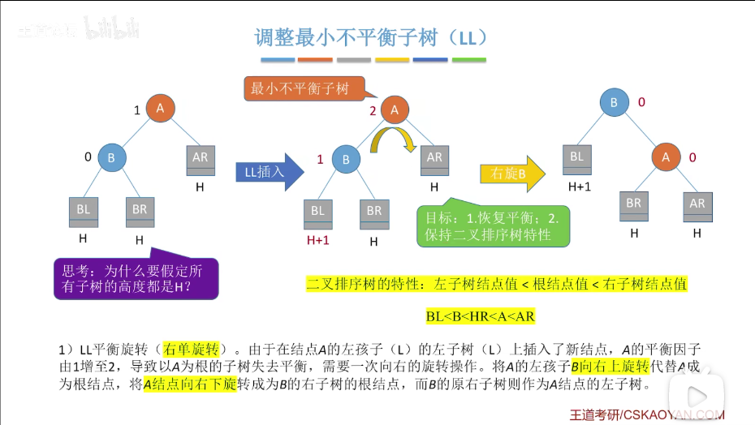
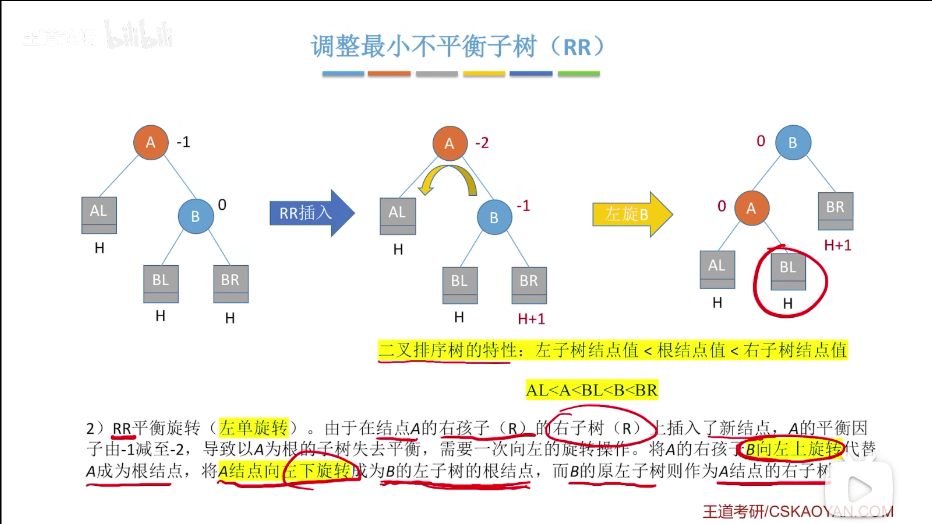
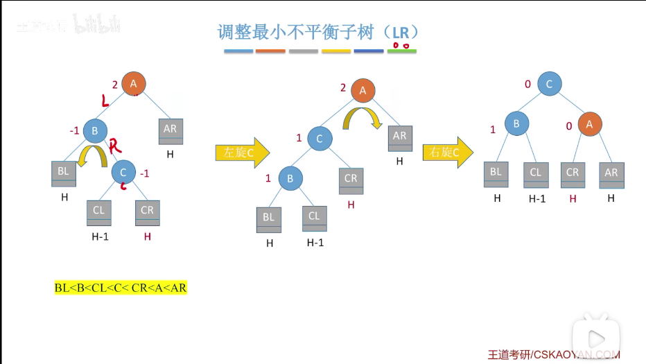
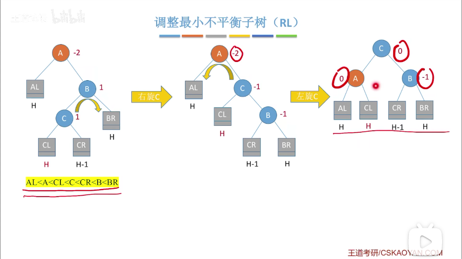
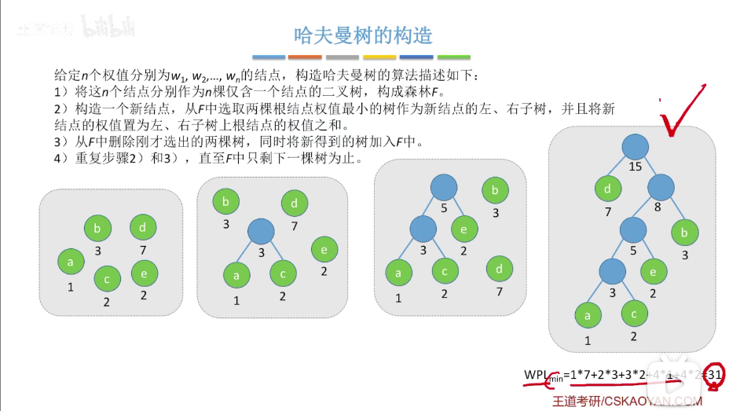

# 二叉树

- 定义：个数为n的结点的集合，其中每个结点要么是空树，要么有一棵左子树或者右子树或者都有或者都没有
- 二叉树左右子树有次序差别，是有序树
- 几种特殊的二叉树：
    - 满二叉树：除最后一层的结点外，所有结点都有左右子树
        - 若高度为h，则共有2h-1个结点
            - 原因：第一层有20个结点，第二层有21个结点...第h层有2h-1个结点，等比数列求和得2h-1个结点
        - 特点：
            1. 只有最后一层是叶子结点
            2. 没有度为1的结点
            3. 按层序为1从左到右、从上到下进行编号，编号为i的结点左子结点编号为2i，右子结点编号为2i+1，父节点编号为⌊i/2⌋(⌊⌋为向下取整)(除根结点)
    - 完全二叉树：
        - 所有结点满足跟满二叉树的前n个结点编号一一对应的二叉树
        - 即从满二叉树的末尾开始删除0(即为满二叉树，满二叉树是一种特殊的完全二叉树)或若干个结点得来(不从末尾删除会打乱编号)
        - 特点：
            1. 只有最后两层可能出现叶子结点
            2. (重点)最多只有一个度为1的结点(有两个或以上会打乱编号，且这个结点孩子只能为左孩子)
            3. 按层序为1从左到右、从上到下进行编号，编号为i的结点左子结点编号为2i，右子结点编号为2i+1，父节点编号为⌊i/2⌋(⌊⌋为向下取整)(除根结点)
            4. i<=⌊n/2⌋为分支结点，i>⌊n/2⌋为叶子结点(⌊⌋为向下取整)
    - 二叉排序树：
        - 空二叉树，或者所有结点均满足：左子树的关键字小于根结点的关键字，且右子树的关键字大于根结点的关键字的二叉树；每个左子树/右子树又是一棵二叉排序树
        - 便于排序和搜索
    - 平衡二叉树：
        - 除叶子结点外，所有结点左子树和右子树的深度之差不超过1
        - 有更高的搜索效率(让树高度更低)
- 常考性质：
    1. (重点)设二叉树中度数为0,1,2的结点数分别为n0,n1,n2，那么n0=n2+1

    - 原因：设树的总结点数为n，
    - I.n=n0+n1+n2
    - II.n=n1+2n2+1
        - 原因：树的总结点数=各结点总度数+1
    - II-I，即得n0=n2+1

    2. 二叉树第i层至多有2i-1个结点(i>=1)
    3. 高度为h的二叉树至多有2h-1个结点(即为满二叉树)
- 常考考点：
    1. 具有n(n>0)个结点的完全二叉树的高度为⌈log2(n+1)⌉(⌈⌉为向上取整)或⌊log2n⌋+1(⌊⌋为向下取整)
        - 原因：
            - 得到⌈log2(n+1)⌉:
                - 由于高度为h的满二叉树结点树为2h-1，所以设该完全二叉树高度为h，则2h-1-1<n<=2h
                  -1，即这个数的结点数n必须大于高度为h-1的结点数最多的二叉树，以使这棵树的高度达到h；但是又不能超过高度为h的结点数最多的二叉树，防止高度达到h+1
                - 一系列化简，得h-1<log2(n+1)<=h
                - 中间式子向上取整，得h=⌈log2(n+1)⌉
            - 得到⌊log2n⌋+1:
                - 由于高度为h-1的满二叉树结点树为2h-1-1，所以对该高度为h的完全二叉树，它至少要比高度为h-1的满二叉树多一个结点，也就是至少有2h-1
                  个结点，但必须少于2h个结点，否则高度将到达h+1，即不等式为2h-1<=n<2h
                - 一系列化简，得h-1<=log2n<h
                - 中间式子向下取整，得h=⌊log2n⌋+1
        - 在完全二叉树中，第i个结点也满足高度为⌈log2(i+1)⌉(⌈⌉为向上取整)或⌊log2i⌋+1(⌊⌋为向下取整)
    2. 对于完全二叉树，设度数为0,1,2的结点数分别为n0,n1,n2，则：
        1. n1为0或1
        2. n0=n2+1，所以n0+n2一定为奇数
            - 因此，如果完全二叉树的结点数为2k(k为正整数)，即为偶数，那么可以推出n0=k，n1=1，n2=k-1
                - 原因：因为n0+n2一定为奇数，所以要保证结点数2k是个偶数，所以n1必定是奇数，才能保证奇+奇=偶，去掉了n1
                  后，结点数还剩2k-1，由于n0=n2+1，所以可以推出n0=k，n2=k-1
            - 同理，如果完全二叉树的结点数为2k-1(k为正整数)，即为奇数，那么可以推出n0=k，n1=0，n2=k-1
- 存储结构：
    1. 顺序存储：
        - 存储方式：每个结点包含数据域和isEmpty字段，将二叉树的结点按照编号存储进数组，并最好将数组的下标0位置空出以保证用于储存结点的下标和编号相同
        - 常用操作，设已知结点编号为i：
            1. 左孩子为2i
            2. 右孩子为2i+1
            3. 父结点为⌊i/2⌋
        - 注意：已知树结点数为n，判断有无左孩子/右孩子/父结点：
            1. 如果是完全二叉树：判断2i是否<=n / 2i+1是否<=n / i是否为1
                - 原因：由于完全二叉树的已用结点编号是连续的，中间没有空缺，所以判断有无孩子只要判断假定孩子的编号是否溢出总结点数，判断有无父结点只要判断它是不是根结点
            2. 如果是非完全二叉树：判断2i/2i+1/⌊i/2⌋的isEmpty属性是否为true
        - 顺序存储只适合存储完全二叉树
            - 原因：最坏情况：当每个结点都只有右孩子时，会造成大量的位置空缺，且如果树高h，仍然需要2h-1个结点大小的存储空间
    2. 链式存储(二叉链表)：
        - 存储方式：每个结点包含数据域和指向左孩子和右孩子的指针
        - 设结点数为n，二叉链表一共有n+1个空链域，可以用来构造线索二叉树
            - 原因：每个结点有2个已用或未用的指针，所以一共有2n个指针，又因为除了根结点外，每个结点头上都有一个已用的指针，这样的指针数量为n-1，2n-(n-1)=n+1，即未用的空指针
        - 找到指定结点的孩子结点：直接访问节点中lchild和rchild指针
        - 找到指定结点的父结点：只能从根节点开始遍历
            - 为了方便查找父结点，可以让二叉链表变成三叉链表，即给每个结点加上指向父结点的parent指针
- 先/中/后/序(根)遍历：
    - 先序遍历：根左右
    - 中序遍历：左根右
    - 后序遍历：左右根
    - 设二叉树高h，时间复杂度为O(h)
    - 常考考点： 给定二叉树，手算遍历顺序
        - 手算方法：
            - 若二叉树为空，什么也不做
            - 若二叉树非空：
                - 从根结点出发，如果左边还没走，优先往左走
                - 碰到尽头(即空结点)则往回走
                - 左边没路了往右走
                - 左右都没路了往上走

                1. 对于先序遍历，在第一次路过结点的时候执行操作
                2. 对于中序遍历，在第二次路过结点的时候执行操作
                3. 对于后序遍历，在第三次路过结点的时候执行操作

            - 补充：算术表达式的分析树：
                - 先序遍历：得到前缀表达式
                - 中序遍历：得到中缀表达式(不含界限符)
                - 后序遍历：得到后缀表达式
    - 应用：求二叉树深度
- 二叉树的层序遍历
  - 步骤：
    1. 初始化一个辅助队列
    2. 让根结点入队
    3. 如果队列非空，让队头结点出队并处理该结点，让左右孩子入队
    4. 重复c直到队列为空
- 由遍历序列手算推出二叉树：
  - 单独的先/中/后序或层序遍历不能推出二叉树形态
  - 要推出二叉树形态，需要：
    1. 先序+中序
    2. 后序+中序
    3. 层序+中序
    - 利用根结点的唯一性，通过先序/后序/层序确定根结点位置，然后再确定左右子树，再确定左右子树的根结点...
    - 先序对应：根结点+左子树的先序序列+右子树的先序序列
    - 中序对应：左子树的中序序列+根结点+右子树的中序序列
    - 后序对应：左子树的后序序列+右子树的后序序列+根结点
    - 层序对应：根结点+左子树的根+右子树的根
- 线索二叉树(线索链表)
  - 线索二叉树的优点：
    1. 遍历可以从任意结点开始
    2. 找指定遍历方式的前驱/后继结点方便
  - 线索：对于前/中/后/层序遍历的方式，将指向这种方式对应的前驱/后继结点(e.g.中序后继)的指针称为前驱/后继线索
    - e.g. 对于中序遍历有序列ABCDEF，那么A的前驱线索是null，A的后继线索是指向B的指针
  - 线索二叉树：将没有左孩子/右孩子的结点的lchild/rchild指针(即空链域)设为指向指定方式的遍历序列的前驱/后继结点，并用ltag/rtag变量标记该结点是否有左/右孩子，0表示有，那么指针指向孩子；1表示无，那么指针是线索
  - 考点：
    1. 给定指定方式的遍历序列，手算画出线索二叉树
    2. 机算将二叉树线索化
- 二叉排序树(二叉查找树BST，Binary Search Tree)
  - 定义：
    1. 空树
    2. 关键字关系：左子树所有结点<根结点<右子树所有结点
  - 中序遍历可以得到一个关键字递增的序列
  - 查找方法：若不为空树，则将目标结点关键字先与根结点比较，相等则比较成功，如果目标小于根结点，则在根结点左子树找，如果大于右结点，在右子树找
    - 如果用循环实现，空间复杂度为O(1)；如果用递归实现，空间复杂度为O(h)
  - 插入方法：如果根结点为空，直接让被插入结点成为根结点，否则如果被插入节点关键字大于根结点，则尝试在根结点的右子树根结点的位置插入；如果小于根结点，则尝试在左子树根结点的位置插入
  - 删除方法；
    1. 被删除结点为叶子结点，直接删除
    2. 被删除结点只有左子树或右子树，将这个结点删除后将子树连接在这个结点的父结点上
    3. 被删除结点既有左子树又有右子树，将这个结点删除后，用它的中序前驱(左子树中关键字最大的结点，也就是左子树中序遍历的最后一个结点)或者中序后继(右子树中关键字最小的结点，也就是右子树中序遍历的第一个结点)来替代这个结点，并将左右子树连接在替代它的中序前驱或中序后继上
  - 常考考点：
    1. 给定关键字序列，构造二叉排序树
       - 不同序列，相同关键字，构造的二叉排序树不一定相同
    2. 查找成功的平均时间复杂度：
       - 查找长度：一次比对需要比较关键字的次数，用来衡量查找的时间多少
       - 平均查找长度(ASL，Average Search Length)的计算：
         - 查找成功 e.g.根结点有左右孩子，求查找成功的平均查找长度：查找树第一层的结点有1个只要一次，第二层有2个要两次，一共3个结点，(1\*1+2\*2)/3=5/3
         - 查找失败 e.g.根结点有左右孩子，求查找失败的平均查找长度：当查找失败时，到达的是叶子结点的左右孩子位置，但是每个失败比对只要比较叶子结点所在层数的次数。一共有2个叶子结点，每个结点有2个左右孩子位置，每个叶子结点都在第2层，所以ASL=(4\*2)/4=2
       - 为了保证ASL足够小，应尽量保证二叉树平衡，也就是让高度尽量小
- 平衡二叉树(AVL树)
  - 定义：每个结点的左右子树深度之差不超过1的二叉树
  - 平衡因子：某个结点的左子树深度-右子树深度
    - 对于平衡二叉树来说，平衡因子只可能为0,1,-1
  - 添加结点后平衡二叉树不平衡，需要调整最小不平衡子树(最接近插入结点的不平衡结点和它的后代构成的子树)
    - 
    - 
    - LL/RR代码思路：
      - 
    - 
    - 
    - 快速做LR：将C的左子树连到B的右孩子位置，将C的右子树连到A的左孩子位置，再让B成为C的左孩子，A成为C的右孩子
      - RL同理
    - 记忆：不管在哪种恢复平衡中，在恢复的每一步只有左孩子能右上旋，右孩子能左上旋
    - 假设平衡二叉树高度为h，至少有nh个结点，则易得n0=0，n1=1，n2=2，且nh=nh-1+nh-2+1
    - 含有n个结点的平衡二叉树最大高度为O(log2n)，平均查找长度为O(log2n)
- 哈夫曼树(最优二叉树)
  - 考点：
    1. 构建哈夫曼树
    2. 哈夫曼编码
  - 结点的权：某一结点的有特殊意义的值
  - 结点的带权路径长度：从根结点到该结点经过的边数\*该结点的权
  - 树的带权路径长度(WPL,Weighted Path Length)：所有叶子结点的带权路径长度之和
  - 哈夫曼树：给定n个带权结点，在所有以这些结点为叶子结点的树中带权路径长度最小的树
  - 构造：
  - 哈夫曼树特点(叶子结点总数为n)：
    1. 结点总数为2n-1
    2. 没有度为1的结点
    3. 不唯一，但WPL都相同且最小
  - 固定长度编码：将不同字符用相同位数的二进制数表示
  - 可变长度编码：将不同字符用不同位数的二进制数表示
  - 前缀编码：如果对于编码集中的编码，没有任何一个编码是另一个编码的前缀，则称这种方式是前缀编码
    - 如果用非前缀编码，会有歧义
  - 用哈夫曼树构造哈夫曼编码：将字符集中每个字符作为叶子结点，将字符出现的频度作为叶子结点的权，用构造哈夫曼树的方法构造哈夫曼编码
    - 应用；哈夫曼编码可以用于压缩文件